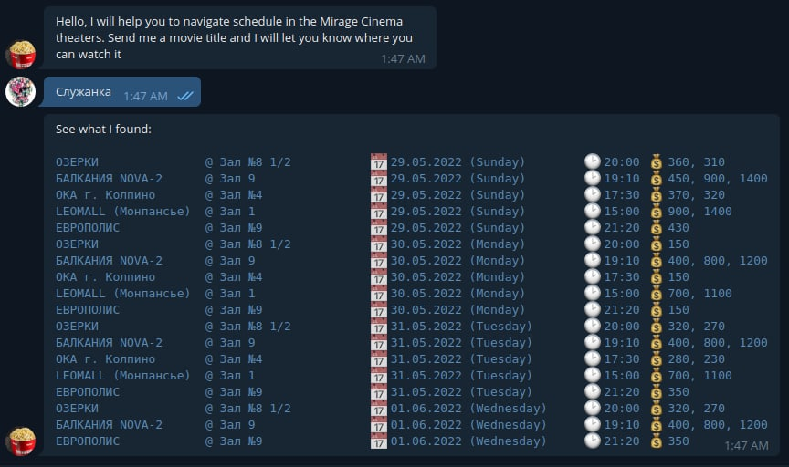

# Misca bot
**Mi**rage cinema **sc**hedule **a**ccessing bot - a small tool for checking for upcoming showtimes in mirage cinema theaters.
## Prerequisites
Before executing the project you would need to create a conda environment using provided yaml file:
```sh
conda env create -f environment.yml
```
## Usage
The main idea behind the project is that the bot is convenient to use through third-party apis as well as via spartan command-line interface.
### Cli
That is, the tool can be used via command line interface like this:
```sh
python -m misca trace-schedule -m Служанка -t 14 -n 3
```
The output is presented in the following format:
```sh
Служанка                                           🌎 ЕВРОПОЛИС [14] 🗺️ пр.Полюстровский, д.84а          @ Зал №9               📅 29.05.2022 (Sunday)   🕑 21:20 💰 430
Служанка                                           🌎 ЕВРОПОЛИС [14] 🗺️ пр.Полюстровский, д.84а          @ Зал №9               📅 30.05.2022 (Monday)   🕑 21:20 💰 150
Служанка                                           🌎 ЕВРОПОЛИС [14] 🗺️ пр.Полюстровский, д.84а          @ Зал №9               📅 31.05.2022 (Tuesday)  🕑 21:20 💰 350
```
### Telegram api
The tool also can be used via telegram bot api. First, you need to run your server passing an appropriate bot token:
```sh
python -m misca start -t foobar
```
And then write the movie title to bot. The bot will fetch available movie sessions from the website and display it to you.

